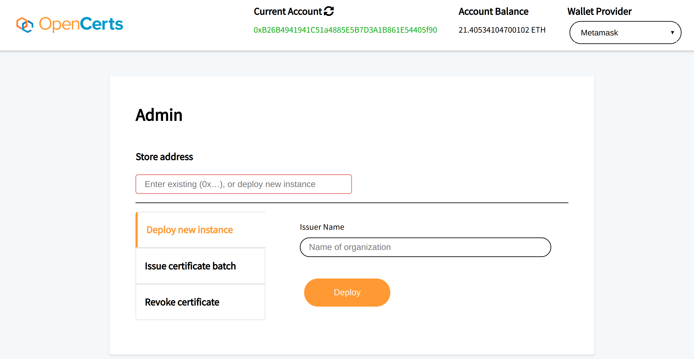

# Deploying Certificate Store

A Certificate Store is a registry of issued and revoked certificates. An institution is required to deploy at least one instance of the Certificate Store smart contract on the Ethereum public main net, as it is used by OpenCerts.io to verify that certificates have been issued. Access to this smart contract is public-read, owner-write. 

To deploy a Certificate Store, the institute must have control of an Ethereum wallet that has sufficient Ether to execute the contract deployment. Refer to [Ethers Required](#ethers-required) for more information on this.

Institutes are recommended to deploy a certificate store on the Ropsten test net before deploying on the Ethereum public main net. 

## Admin Interface

A simple admin interface is provided to allow anyone to deploy an instance of the certificate store on Ethereum at [https://admin.opencerts.io](https://admin.opencerts.io). 

## Deploying a Certificate Store
### Ethers Required
The smart contract requires `601255 gas` to deploy, and at a safe Gas Price of `10 GWei` you will require `0.0060126 Eth` to successfully deploy it. For more information on Gas and Gas Prices, check out [this article](https://ethereum.stackexchange.com/questions/3/what-is-meant-by-the-term-gas)

### Development

The admin interface supports the ropsten network for development and testing. Visit [Appendix A: Getting Testnet Account & Ethers](./appendix_test_accounts.md) to get a funded Ethereum wallet to follow the instructions below.

### Network/Application Selection

To deploy a Certificate Store, simply select the network on the network selector on the top right. For Metamask user, the network selection is in the Metamask application, you must select Metamask in the network selector.

Once the network has been selected, you will see your wallet address reflected in the account section. Click on refresh if it is not updated. For Ledger Nano user, be sure to log into the device and select the Ethereum application for this to work. 

### Certificate Store Deployment

Enter the issuer name (ie. University of Blockchain) and click on deploy. 

For Ledger Nano User:
Review and submit the transaction on the Ledger Nano device itself.

For Metamask User:
Review and submit the transaction on the Metamask application popup.  

### Confirmation

Once the transaction has been mined on the Ethereum network, you will see a message showing the successful deployment. 

Important:
**Please record the certificate store address. This will be the address used to identify your institute in all the certificates issued by the institute (and stored in each certificate file).**

### Debugging

There might be instances where the store is deployed but there were no confirmation receipts with the certificate store address.

For such cases, simply visit [http://etherscan.io/](http://etherscan.io/) or [http://ropsten.etherscan.io/](http://ropsten.etherscan.io/) to view the status of the transaction. 

## Production Deployment

Institutes are recommended to make use of a hardware security module instead of Metamask to deploy and interact the certificate store to ensure key safety. One such hardware security module is the Ledger Nano.
