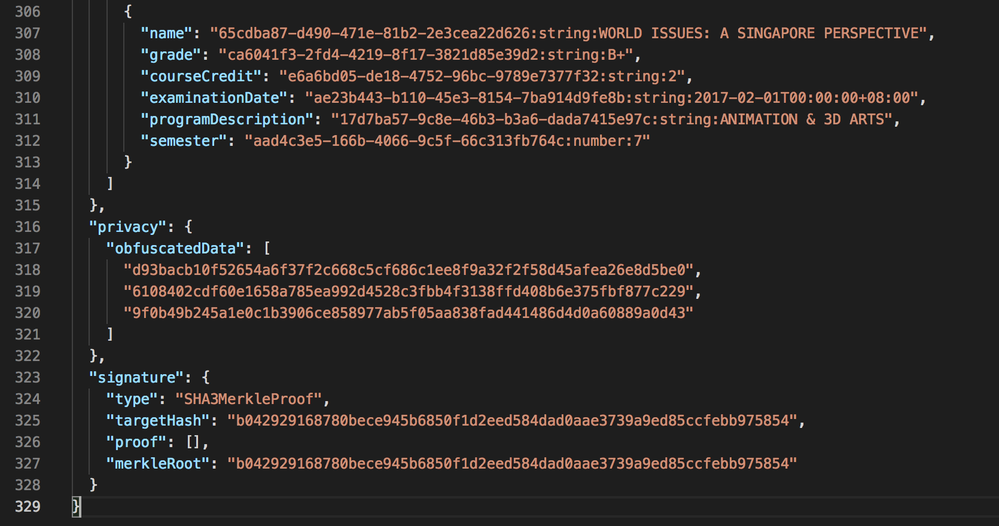

# Data Obfuscation in Custom Certificate Template

OpenCerts allow users to take control of what type of data they will like to share with others. For instance, a student can choose to share only the certificate and hide his transcript if he is only required to submit a proof of graduation.

To facilitate this, certificate templates can expose this function to their users. Developers of the certificate templates will have discretion on the granularity of the controls. For instance, a button can be created to hide the entire transcript or a delete button can be added to each field to remove only one value. 

## Example - Default Certificate


The default certificate found [here](./files/DEFAULT_CERTIFICATE.opencert) shows how the privacy filter can be implemented.

To enable editing, click on the edit button on the banner.

To obfuscate values from the transcript, click on the red crosses beside the individual values in the transcript.

The new certificate with obfuscated values can be downloaded with the download button above the "View another" button. 

## Implementing Privacy Filter

### Exposing the handleObfuscation method

```js
import PropTypes from "prop-types";
import { MultiCertificateRenderer } from "template-utils/MultiCertificateRenderer";
import DefaultCert from "./certificate";

const templates = [
  {
    id: "certificate",
    label: "Certificate",
    template: DefaultCert
  }
];

const DefaultTemplate = ({ certificate, handleObfuscation }) => (
  <MultiCertificateRenderer
    certificate={certificate}
    templates={templates}
    handleObfuscation={handleObfuscation}
  />
);

DefaultTemplate.propTypes = {
  certificate: PropTypes.object.isRequired,
  handleObfuscation: PropTypes.func
};
export default DefaultTemplate;
```

To enable the privacy filter for your certificate, ensure that `handleObfuscation` method is passed into the `MultiCertificateRenderer` when registering the certificate template. This will pass the `handleObfuscation` method into your certificate template which can be used to obfuscate data on the certificate. 

### Using the handleObfuscation method

Using the `handleObfuscation` method is easy. Passing in the path of the data you like to remove will remove that value or all elements in that object. 

Some examples can be found below:

Removing the grade of the first item in the transcript
```js
handleObfuscation("transcript[0].grade")
```

Removing the first item in the transcript
```js
handleObfuscation("transcript[0]")
```

Removing the entire transcript
```js
handleObfuscation("transcript")
```

Removing the nric of the student
```js
handleObfuscation("recipient.nric")
```

### Code References

The implementation of data obfuscation for the default certificate can be found at [https://github.com/OpenCerts/opencerts-website/blob/master/src/components/CertificateTemplates/Default/certificate.js](https://github.com/OpenCerts/opencerts-website/blob/master/src/components/CertificateTemplates/Default/certificate.js).

## Design Recommendation

### Use Stateful Component

Having a stateful component which tracks if the certificate is `editable` will allow two different views of the certificate.

In the default certificate example, we can see it tracking the `editable` state. When the `editable` flag is set, red crosses will appear beside values that the user can obfuscate. When it is not, the certificate appears to be a normal static certificate.  

### Reuse & Contribute to Common Template Components

During the design of the default certificate, the `ObfuscatableValue` and `SimplePrivacyFilterBanner` is created to be reused for other certificates. 

The `SimplePrivacyFilterBanner` component tells the user that the certificate is editable, allow them to toggle the editable state, and disappear upon print. 

The `ObfuscatableValue` component is a helper function to easily create values that can be removed. 

We recommend the use of these components. Should they not fulfill the use case, contribution to the common components found in `src/components/TemplateCommon/Privacy` is welcomed. 

## Understanding the Data Obfuscation Process




Data in the certificate is not removed in this process. Instead the values are hashed and stored in the `privacy.obfuscatedData` section of the new .opencert file. Storing it in the hashed format allows the certificate's `targetHash` to remain unchanged and prevents reverse engineering of the value (even through rainbow table attacks). 
