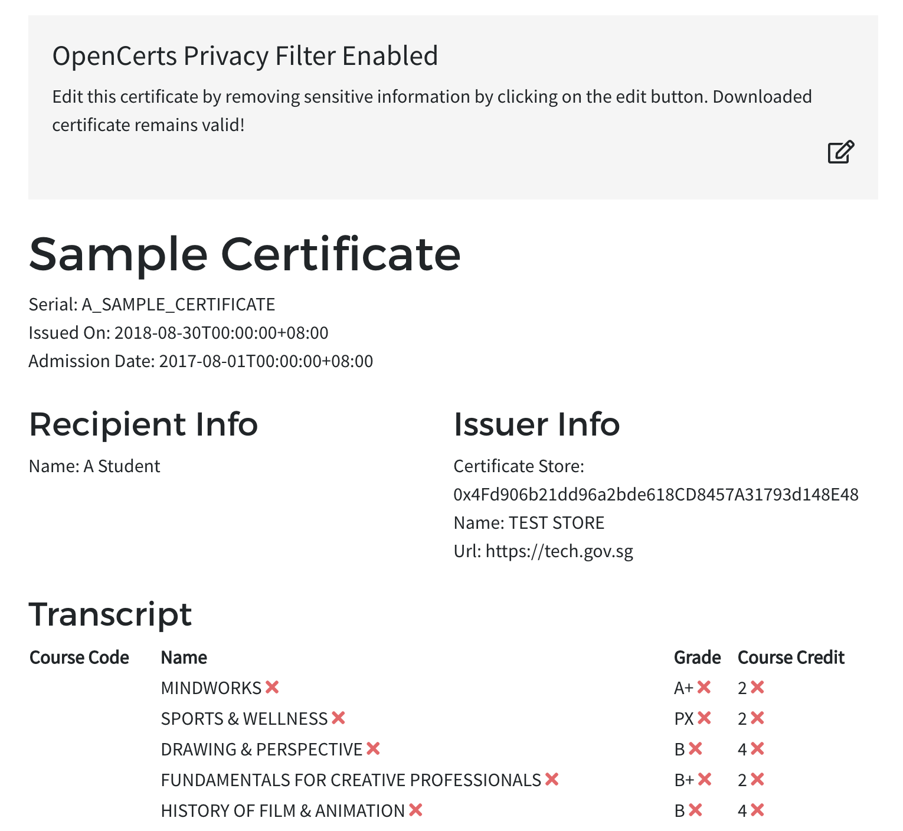

# Data Obfuscation in Custom Certificate Template

OpenCerts allow users to take control of what type of data they will like to share with others. For instance, a student can choose to share only the certificate and hide his transcript if he is only required to submit a proof of graduation.

To facilitate this, certificate templates can expose this function to their users. Developers of the certificate templates will have discretion on the granularity of the controls. For instance, a button can be created to hide the entire transcript or a delete button can be added to each field to remove only one value.

## Example - Default Certificate



To enable editing, click on the edit button on the banner.

To obfuscate values from the transcript, click on the red crosses beside the individual values in the transcript.

The new certificate with obfuscated values can be downloaded with the download button above the "View another" button.

## Implementing Privacy Filter

`SimplePrivacyFilterBanner.js`

This is the privacy banner that allows the user to toggle the editable state.

```js
import React from "react";
import PropTypes from "prop-types";
import { FontAwesomeIcon } from "@fortawesome/react-fontawesome";
import { faEdit } from "@fortawesome/free-solid-svg-icons";

const SimplePrivacyFilterBanner = ({ toggleEditable }) => (
  <div id="banner-privacy-filter" className="screen-only">
    <div className="row">
        <div className="h4">OpenCerts Privacy Filter Enabled</div>
        <div>
          Edit this certificate by removing sensitive information by clicking on
          the edit button. Downloaded certificate remains valid!
        </div>
      </div>
      <div
        onClick={toggleEditable} // function to toggle the state to enable/disable editing
      >
        <FontAwesomeIcon icon={faEdit} cursor="pointer" />
      </div>
    </div>
  </div>
);

SimplePrivacyFilterBanner.propTypes = {
  toggleEditable: PropTypes.func
};

export default SimplePrivacyFilterBanner;
```

`ObfuscatableValue.js`

The handleObfuscation function is passed as a `prop` into this component and obfuscates the corresponding field if the editable state is true.

```js
import React from "react";
import PropTypes from "prop-types";
import css from "./obfuscatableValueStyles.scss";
import { FontAwesomeIcon } from "@fortawesome/react-fontawesome";
import { faTimes } from "@fortawesome/free-solid-svg-icons";

const ObfuscatableValue = ({ field, value, handleObfuscation, editable }) =>
  value ? (
    <div
      onClick={() => {
        if (editable) {
          handleObfuscation(field);
        }
      }}
    >
      {value}{" "}
      {editable && (
        <FontAwesomeIcon
          icon={faTimes}
          cursor="pointer"
          className={`${css["remove-icon"]}`}
        />
      )}
    </div>
  ) : null;

ObfuscatableValue.propTypes = {
  field: PropTypes.string,
  value: PropTypes.oneOfType([PropTypes.string, PropTypes.number]),
  handleObfuscation: PropTypes.func,
  editable: PropTypes.bool
};

export default ObfuscatableValue;
```

### Using the handleObfuscation method

To enable the privacy filter for your certificate, ensure that `handleObfuscation` method is passed into the **template you want to enable obfuscation** when registering the certificate template. This will pass the `handleObfuscation` method into your certificate template which can be used to obfuscate data on the certificate. An example is shown below:

`transcript.js`

```js
class Template extends Component {
  constructor(props) {
    super(props);
    this.state = { editable: false };
  }

  render() {
    const { editable } = this.state;
    const { document, handleObfuscation } = this.props;
    /// Other information below
```

Using the `ObfuscateValue` component is easy. Passing in the path of the data you like to remove will remove that value or all elements in that object.

```js
render() {
   // Other information above
    const transcriptData = get(document, "transcript", []);

    const transcriptSection = transcriptData.map((t, i) => (
      <tr key={i}>
        <td>
          <ObfuscatableValue />
            editable={editable}
            field={`transcript[${i}].courseCode`}
            value={t.courseCode}
            handleObfuscation={handleObfuscation}
          />
        </td>
        ...
      </tr>
    ));

    return (
      <div className="container">
        <SimplePrivacyFilterBanner
          toggleEditable={() => this.setState({ editable: !editable })}
        />
        </div>
      {transcriptSection} // Data with obfuscation enabled passed in here
```

The full source code example can be found in our transcript.js file for our OpenCerts demo certificate [here](./files/transcript.js).

### Code References

The implementation of data obfuscation for the demo certificate can be found at [https://github.com/OpenCerts/demo-opencerts-renderer/tree/master/src/components/TemplateCommon/Privacy](https://github.com/OpenCerts/demo-opencerts-renderer/tree/master/src/components/TemplateCommon/Privacy).

## Design Recommendation

### Use Stateful Component

Having a stateful component which tracks if the certificate is `editable` will allow two different views of the certificate.

In the default certificate example, we can see it tracking the `editable` state. When the `editable` flag is set, red crosses will appear beside values that the user can obfuscate. When it is not, the certificate appears to be a normal static certificate.

### Reuse & Contribute to Common Template Components

During the design of the default certificate, the `ObfuscatableValue` and `SimplePrivacyFilterBanner` is created to be reused for other certificates.

The `SimplePrivacyFilterBanner` component tells the user that the certificate is editable, allow them to toggle the editable state, and disappear upon print.

The `ObfuscatableValue` component is a helper function to easily create values that can be removed.

We recommend the use of these components. Should they not fulfill the use case, contribution to the common components found in `src/components/TemplateCommon/Privacy` is welcomed.

## Understanding the Data Obfuscation Process


During data obfuscation, data in the certificate is replaced with an irreversible hash and stored in the `privacy.obfuscatedData` section of the new .opencert file.

Storing it in the hashed format allows the certificate's `targetHash` to remain unchanged and prevents reverse engineering of the value (even through rainbow table attacks).
