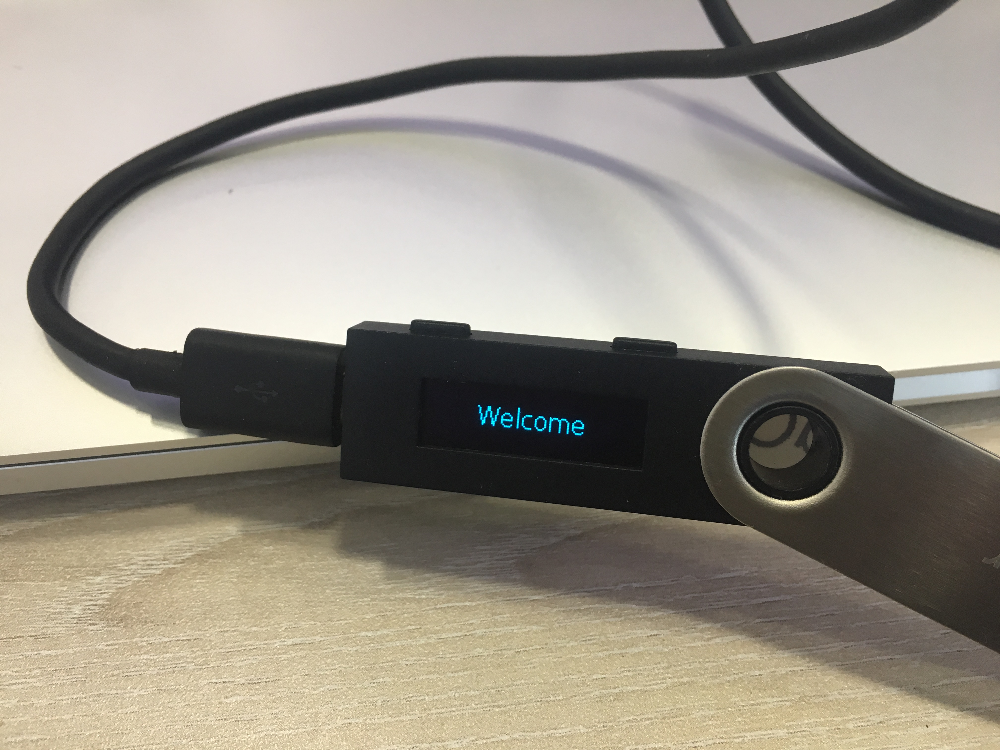
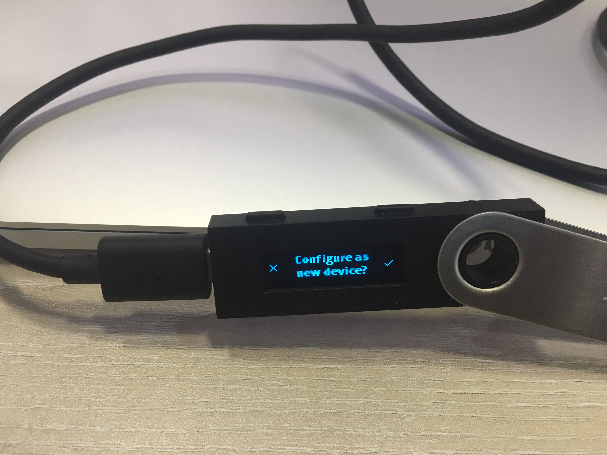
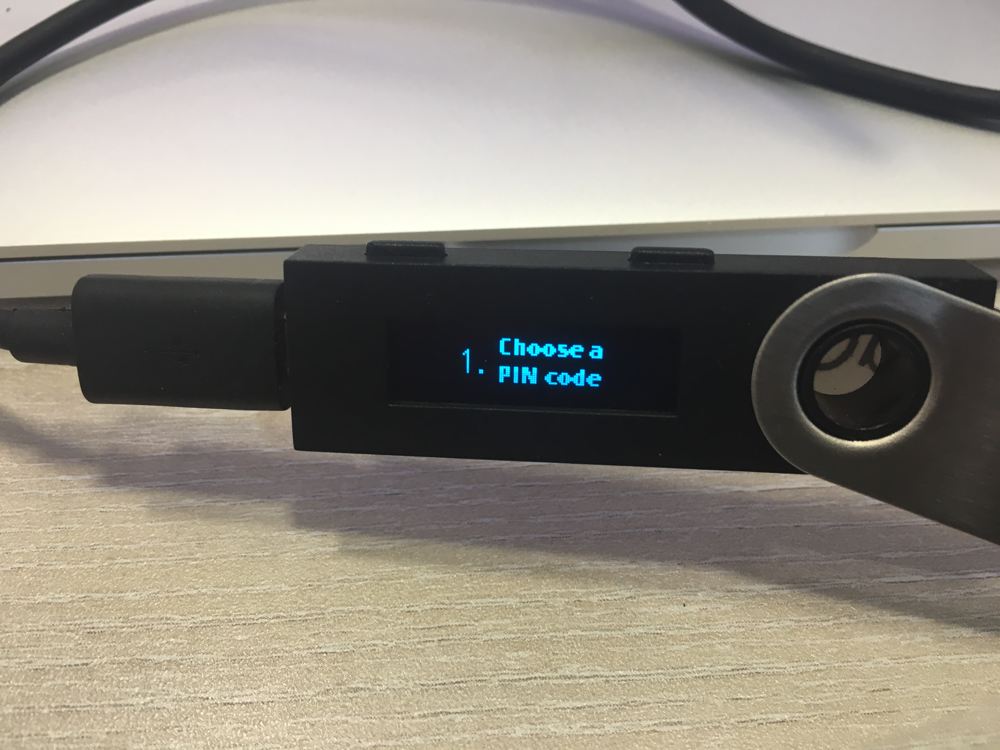
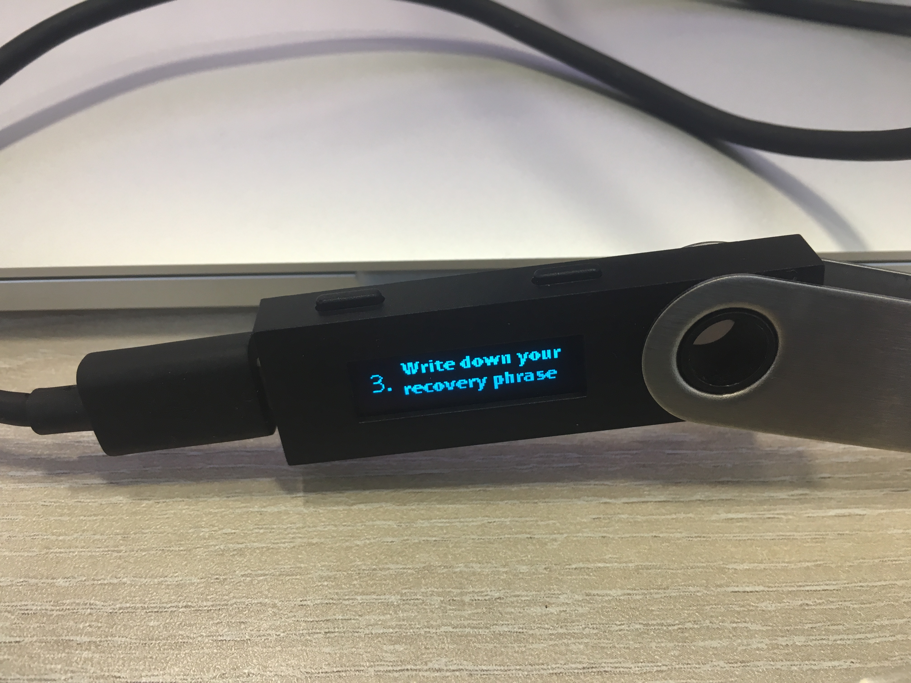
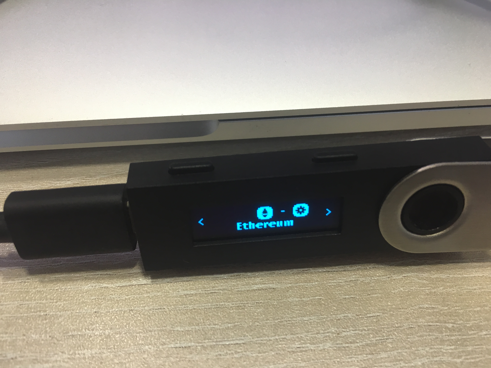
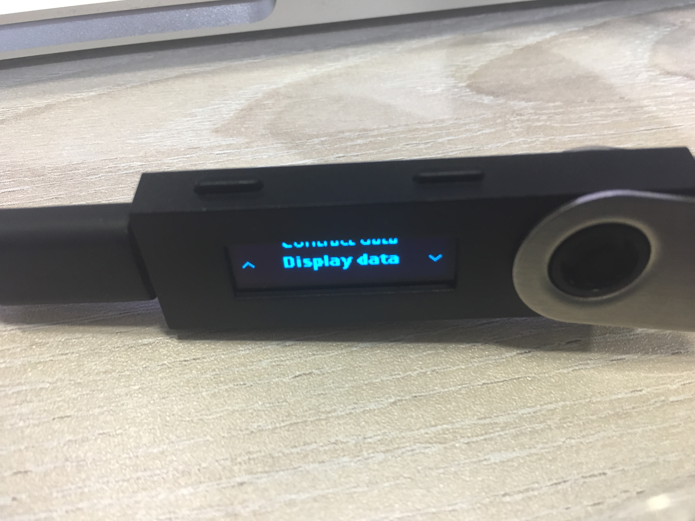
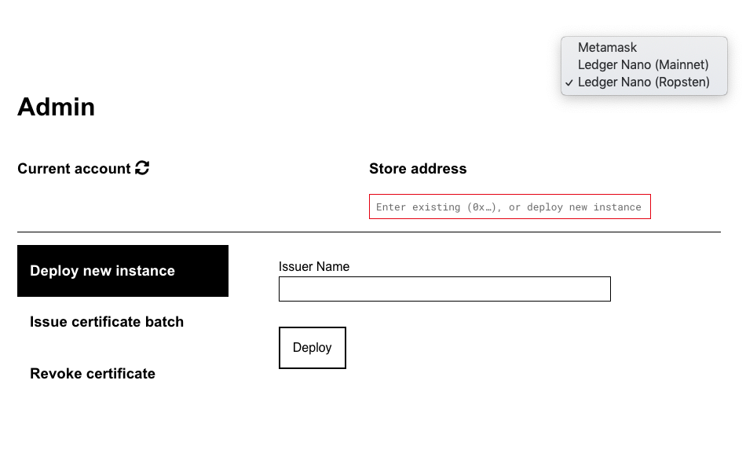

# Ledger Nano Initialisation Procedure

### Pre-requisites to begin procedure:

###### Required participants 

- 1 x Wallet device holder - Role: to keep the physical wallet device safe 

- 1 x PIN holder - Role: to select a PIN and serve as the transaction initiator

- 2 x Recovery Words Holders - recommended to split the recovery words between at least two persons as anyone who holds the full 24 word set has ultimate control over the Ethereum wallet even without the device.

###### Required equipment
	
- Ledger Nano S Hardware Wallet Device (new in packaging)

- Computer with Chrome Browser **(mandatory)**, USB access and Internet Access

- 1 Ether procured and held in temporary acquisition wallet

### Initialisation Procedure 

1. (Wallet device holder) Unpack device from the original packaging, use included Micro USB cable to attach device to computer

2. (Wallet device holder) Ledger Nano S device will power on automatically

3. (Wallet device holder) Choose setup as new device

###### Handover to PIN holder

4. (PIN holder) Set PIN

5. (PIN holder) Confirm PIN

###### Handover to recovery words holder

6. (Recovery words holders) Record recovery phrase

7. (Recovery words holders) Confirm recovery phrase

###### Handover to PIN holder

8. (Pin holder) Configure Ledger Device settings as follows:
	
	Settings > Security > Auto Lock : 1 Minute
	
	
	
9. (PIN holder) Install Ledger Live application on the computer https://www.ledger.com/pages/ledger-live

10. (PIN holder) Update firmware using Ledger Live

11. (PIN holder) Install Ethereum app using Ledger Manager included in Ledger Live

12. (PIN holder) Configure Ethereum App settings as follows:
	
	Ethereum > Settings > Contract Data: yes
	
	
	Ethereum > Settings > Display Data: yes
	

13. Go to Https://admin.opencerts.io , switch selector to Ledger Nano Mainnet or Testnet (Address will be the same on both networks.)

14. Click on refresh to see your wallet address for transferring ether to. If the wallet address does not show up, check that the Ledger Nano S is unlocked and has the Ethereum App activated.

15. Do experiment with it on Testnet before going live! You can obtain testnet ethers from https://faucet.metamask.io/ if you have Metamask, then send it from your Metamask wallet to your Ledger Nano S wallet address.

### Things to try on testnet (Ropsten) before going live:

- Transferring ether
	
- Deploying Contract Store using admin.opencerts.io -> After you have deployed a contract store, contact us to get this set up as a recognised issuer. You will need to provude us with the transaction address e.g https://ropsten.etherscan.io/tx/0x950e18190dbb4971719b3048831e04f6dffd5dbad81982d8e1a2c30fe12a46b0
	
- Issuing a certificate using the testnet contract store address