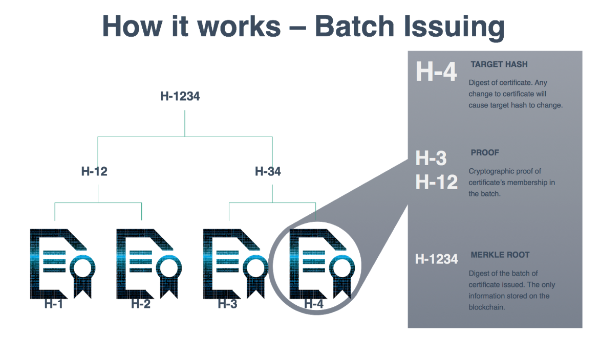

# Batching Certificate



OpenCerts is able to batch large number of certificates to be issued on the Ethereum blockchain in a single transaction. 

To facilitate the ease of writing/generating OpenCerts a [npm package](https://www.npmjs.com/package/@govtechsg/open-certificate) and a [CLI tool](https://github.com/GovTechSG/certificate-cli 
) is provided. 

## Prerequisite

### Environment

- [Git](https://www.linode.com/docs/development/version-control/how-to-install-git-on-linux-mac-and-windows/)
- [Node.js](https://nodejs.org/en/download/)

### OpenCerts Data File

To follow through this section, please have all the certificates generated from the previous step in a single folder. 


## CLI Tool

### Installing the CLI Tool

Clone the git repository to your local environment

> git clone https://github.com/GovTechSG/certificate-cli.git

Navigate into the directory

> mv certificate-cli

Install the dependencies for the package

> npm install --production --ignore-scripts

### Using the CLI Tool

Place the unsigned certificates into a folder

> mkdir unsigned_certs
> mv <path/certs> unsigned_certs

Run the CLI Tool to batch the certificates

> node index.js batch unsgined_certs signed_certs

Sample output:

```
2018-08-30T05:06:55.313Z info: Batch Certificate Root: 70250f22ecaa7c12cdde4a4bc6dc3bf2464433691cd462bcfe980d7e85f6a06c
```

Upon successful batching of the certificates, the merkle root for the entire batch will be printed and the signed certificates will be found in the folder `signed_certs`. 

Note the merkle root, it will be [published onto the certficate store](./issuing_certificates.md) in later steps. 

## NPM Package

For the documentations for writing custom application to process the certificates, [refer to the documentation for OpenCerts](https://github.com/GovTechSG/open-certificate)
