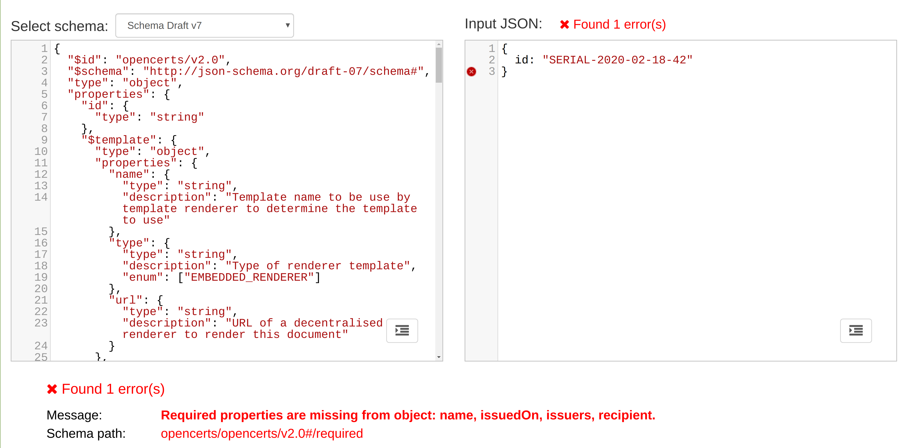

# Creating Certificates


The OpenCerts file is a `.json` file that conforms to the [OpenAttestation](https://github.com/GovTechSG/open-attestation) specification. 

At the root level, each file contains information on the schema type (OpenCerts), certificate data, hidden data (from privacy filter) and a signature. Details of the OpenAttestation file format can be found on the [Github page](https://github.com/GovTechSG/open-attestation). 

What you will be most concern with is the certificate data. All these data are stored in the `data` key on the OpenCerts file and conforms to the [OpenCerts schema](https://github.com/GovTechSG/open-certificate/blob/master/schema/1.3/schema.json).

For this section, we will focus on populating the certificate data that conforms to the schema. 

## OpenCerts Schema

The shape of the certificate object is defined using [JSON Schema](https://json-schema.org/). The definition can be found at [https://github.com/GovTechSG/open-certificate/blob/master/schema/1.3/schema.json](https://github.com/GovTechSG/open-certificate/blob/master/schema/1.3/schema.json). 

## Using JSON Schema Validator

An useful online tool to help you understand the JSON schema is the [JSON Schema Validator](https://www.jsonschemavalidator.net/).

Simply paste the content of the schema document on the left panel and you can start writing the certificate data on the right. The tool will instantly validate the certificate data shape and will notify you of potential errors.



You can see that the validation failed because of missing properties on JSON Schema Validator

## The Minimalist Certificate

```json
{
  "id":"2018091259",
  "name":"Bachelor of Blockchain",
  "issuedOn":"2018-08-01T00:00:00+08:00",
  "issuers":[{
    "name":"University of Blockchain",
    "certificateStore":"0x1989a05B320186f5fAc590fFf64730FC9099Bc7b"
  }],
  "recipient":{
    "name":"John Snow"
  }
}
```

The simplest certificate contains the values for `id`, `name`, `issuedOn`, `issuers` and `recipient`. 

Try creating a minimal certificate using the tool above to get an idea of what goes into a certificate. 

### `id` Field

The `id` field is a string used to uniquely identify the certificate. In most cases, the serial number of the corresponding physical certificate can be used. 

Alternatively, a random [uuid](https://en.wikipedia.org/wiki/Universally_unique_identifier) can be generated and used here. 

### `name` field

The `name` field is a string that refers to the name of the certificate. 

### `issuedOn` field

The `issuedOn` field is a date-time string conforming to the [ISO 8601, RFC 3339](https://tools.ietf.org/html/rfc3339#section-5.6) format.

Example of a valid `issuedOn` string is `2018-08-31T23:59:59+08:00`. Where it specifies the date-time 23:59 hr on 31/08/2018, in the timezone GMT +8. 

### `issuers` field

The `issuers` is an array of the issuer object. The required fields for each issuer is `name` and `certificateStore`. Other fields such as `did`, `url`, `email` and `phone` are also recognised. 

The `name` specifies the name of the issuing body while the `certificateStore` specifies the smart contract address of the certificate store deployed by the issuing body. 

The `certificateStore` address can be obtained after [deploying an instance of the smart contract](./deploying_store.md).

### `recipient` field

The `recipient` is an object of the recipient. The only required field is `name` while other properties such as `did`, `url`, `email` and `phone` are available. 

## The Complete Certificate

Once you are done with the minimal certificate, you can include more data such as `transcript` and `additionalData` into the certificate.

```json
{
  "id":"2018091259",
  "name":"Bachelor of Blockchain",
  "issuedOn":"2018-08-31T23:59:59+08:00",
  "issuers":[{
    "name":"University of Blockchain",
    "url":"https://universityofblockchain.com",
    "certificateStore":"0x1989a05B320186f5fAc590fFf64730FC9099Bc7b"
  }],
  "recipient":{
    "name":"John Snow",
    "email":"johnsnow@gmail.com",
    "phone":"+6588888888"
  },
  "transcript":[{
    "name":"History of Blockchain",
    "grade":"B+",
    "courseCredit":3,
    "courseCode":"HIST-BTC",
    "url":"https://universityofblockchain.com/sub/hist-btc",
    "description":"Understanding the origins of the blockchain."
  },{
    "name":"Ethereum Smart Contracts",
    "grade":"A",
    "courseCredit":3,
    "courseCode":"ETH-SC",
    "url":"https://universityofblockchain.com/sub/eth-sc",
    "description":"Understanding how to write smart contracts on the Ethereum network."
  }],
  "additionalData": {
    "signature":"data:image/jpeg;base64...."
  }
}
```

### `transcript` field

The `transcript` field is an array of transcript objects. Each object is required to have the `name` value and can optionally hold values for `grade`, `courseCredit`, `courseCode`, `url`, `description` and `score`. 

Additional properties can also be added to the `transcript` objects. 

### `additionalData` field

Can't find any place to insert data into? `additionalData` is the right place to put it.

The `additionalData` field is an object that allows you to insert any type of data into it. These data will be present for [custom certificate templates](./custom_template.md). 

Some examples of data that can be in `additionalData` are:

- Signatures to be rendered on the certificate
- Co-curriculum activities records
- Awards and accolades
- Student conduct
- Testimonies

## Saving the Certificate

Once the certificate data has been created/generated, simply export it as a `.json` file. All the certificates will be batched together to be committed onto the blockchain with the [CLI tool](https://github.com/GovTechSG/certificate-cli 
) or your custom node.js application using the [npm package](https://www.npmjs.com/package/@govtechsg/open-certificate) later.
