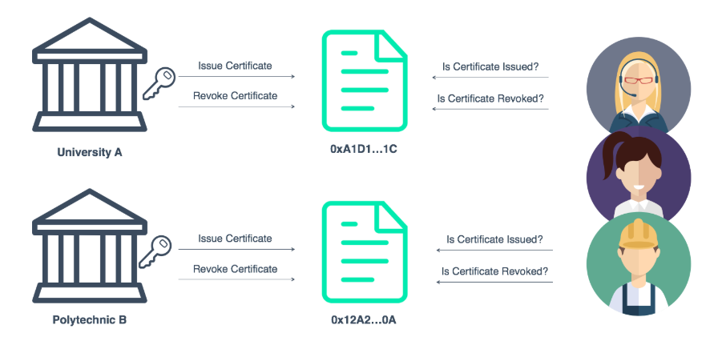
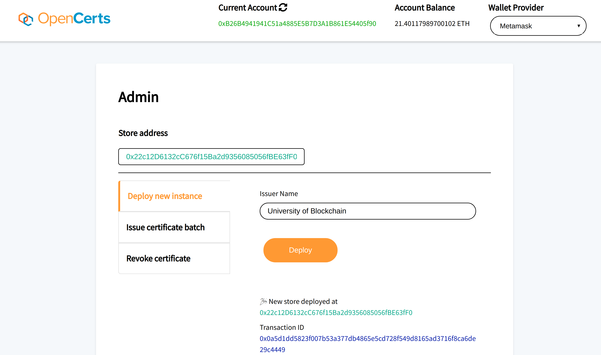

# Deploying Certificate Store

The certificate store is a smart contract on the Ethereum network that stores the state of all the certificates issued and revoked. Each institute is required to deploy an instance of the certificate store to allow OpenCerts.io to check the status of the certificates against. 

To do so, the institute must have a Ethereum wallet with enough ethers. 

Institutes are recommended to deploy a certificate store on the Ropsten test net before deploying on the main Ethereum network. 

## Admin Interface

A simple admin interface is provided to allow anyone to deploy an instance of the certificate store on Ethereum at [https://govtechsg.github.io/certificate-web-ui/admin](https://govtechsg.github.io/certificate-web-ui/admin). 

## Deploying a Certificate Store

### Development

The admin interface supports the ropsten network for development and testing. Visit [Appendix A: Getting Testnet Account & Ethers](./appendix_test_accounts.md) to get a funded Ethereum wallet to follow the instructions below.

### Network/Application Selection

To deploy a certificate store, simply select the network on the network selector on the top right. For Metamask user, the network selection is in the Metamask application, you simply select Metamask in the network selector.

Once the network has been selected, you will see your wallet address reflected in the account section. Click on refresh if it is not updated. For Ledger Nano user, be sure to log into the device and select the Ethereum application for this to work. 

### Certificate Store Deployment

Enter the issuer name (ie. University of Blockchain) and click on deploy. 

For Ledger Nano User:
Review and submit the transaction on the Ledger Nano device itself.

For Metamask User:
Review and submit the transaction on the Metamask application popup.  

### Confirmation

Once the transaction has been mined on the Ethereum network, you will see a message showing the successful deployment. 

Important:
**Do note down the certificate store address. This will be the address used to identity your institute in all the certificates issued by the institute (and stored in each certificate file).**

### Debugging

There might be instances where the store is deployed but there were no confirmation receipts with the certificate store address.

For such cases, simply visit [http://etherscan.io/](http://etherscan.io/) or [http://ropsten.etherscan.io/](http://ropsten.etherscan.io/) to view the status of the transaction. 

## Production Deployment

Institutes are recommended to make use of a hardware security module instead of Metamask to deploy and interact the certificate store to ensure key safety. 